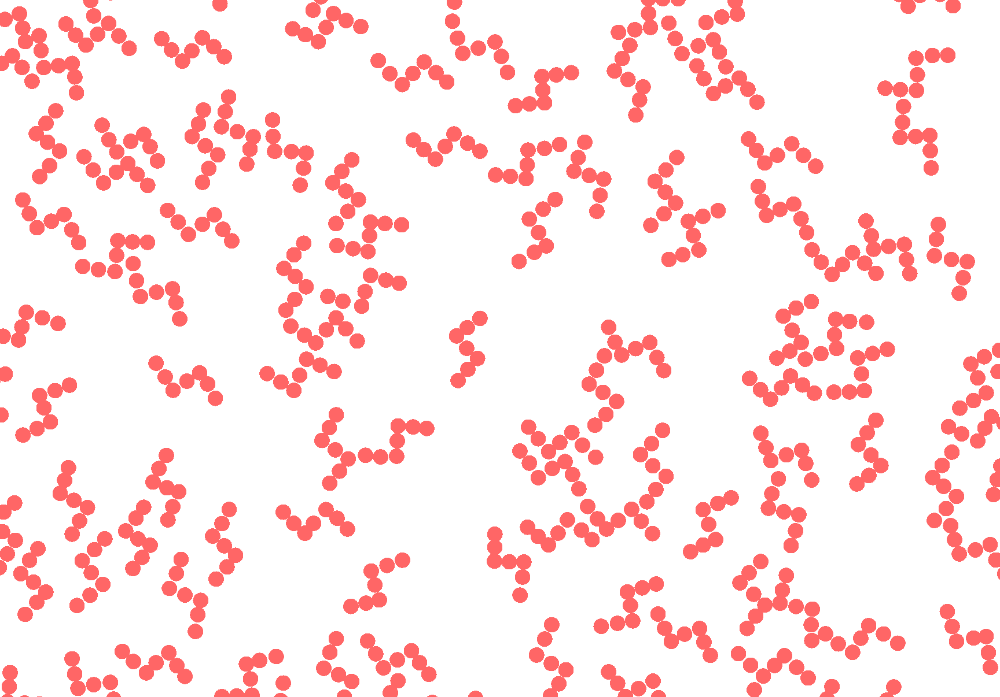

# 2D-chiral-fluids

This repository includes LAMMPS simulation scripts for finding transport coefficients of 2D chiral fluid, using both NEMD's and Green-Kubo computations. As a part of this, there are included some custom LAMMPS computes for finding the center-of-mass coarse-grained kinetic and virial stress for molecules, including the spin "temperature" and translational "temperature" on a molecular level, and a fix to torque the chiral molecules.

Some notes on the stress computes:

Note 1: The virial compute only works, if molecule ID's are shared between processors, which isn't done by default. This can be done by using the "full" atom style, it can also be custom implemented in LAMMPS (there is guidance inside the source code on how to do this) or possibly implemented using the fix with for example: "fix shareMol all property/atom mol ghost yes".

Note 2: The minimum image convention used in the virial compute could give problems if cutoff > boxsize/2. It is a good idea to use large box sizes to avoid this.

Note 3: The stress computes with "sum" in the name computes the volume averaged stress. The stress computes with "2dsum" in the name are optimized for 2d but otherwise completely identical to the ones with just "sum" in the name. The compute compute_kineticcomstress_sum_chunk assumes that the systems total velocity is zero. However, the compute compute_kineticcomstress_chunk subtracts the local macroscopic velocity to get the thermal fluctuations when given a temperature profile. The compute "compute_active_chunk.h" computes the volume averaged bead stress coming from the torquing of the beads in each molecule around their respective centers of mass.

Note 4: The "fix_torque_chunk.cpp" is a fix that torques the atoms in a chunk around the center of mass of the chunk.

These computes are currently still being worked on, so changes or corrections might happen.
